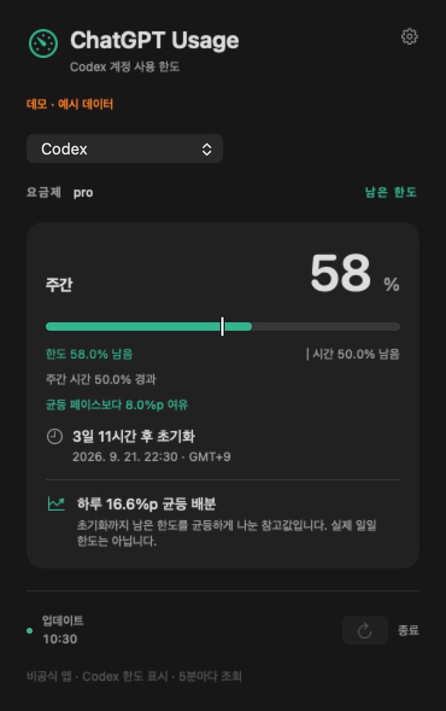

# ChatGPT Usage

**내 계정의 Codex 한도와 초기화 시간을 Mac 메뉴 막대에서 확인한다.**

[English](README.md) · [다운로드](https://github.com/Sunjae-L22/chatgpt-usage/releases)

[개발기](https://it-study-2002.tistory.com/entry/chatgpt-usage-codex-macos) · [GitHub 자동 검증 결과](https://github.com/Sunjae-L22/chatgpt-usage/actions/runs/34976462549)

ChatGPT 계정에 연결된 **Codex 구독 한도**를 보여주는 비공식 macOS 앱이다. 요금제 이름으로 한도를 추측하지 않고, 서버가 실제로 반환한 기간과 초기화 시각을 표시한다. 주간 한도만 있는 계정에는 주간 카드 하나가 나타난다.

일반 ChatGPT 대화의 모델별 메시지 한도나 OpenAI API 비용을 측정하는 앱은 아니다. 한도 비율을 남은 메시지 수나 토큰 수로 바꾸지 않는다.



*공개 화면은 데모 데이터다. 개인 계정 정보는 포함하지 않았다.*

## 기능

- 메뉴 막대에 선택한 항목의 남은 한도 표시. 주간 한도가 있으면 이를 우선 표시한다.
- 실제 응답에 따라 주간·5시간·기타 기간 표시. 별도 모델 한도는 선택 메뉴로 전환한다.
- 요금제 식별자 원문, 현지 시간대의 초기화 날짜, 남은 시간 표시.
- 1일 이상의 기간에 대해 `남은 한도 ÷ 초기화까지 남은 일수`로 균등 배분 참고값 제공. 공식 일일 한도나 사용량 예측은 아니다.
- 실행 시·5분마다·절전 복귀 시 자동 조회, 수동 새로고침 지원.
- 조회 실패·오래된 값·초기화 시각 경과 상태 구분.
- 한국어·영어, 로그인 시 실행 옵션.

## 페이스메이커 읽는 법

한도 막대와 세로 기준선은 모두 100%에서 0%로 줄어든다. 막대는 **남은 한도**, 세로선은 **초기화까지 남은 시간의 비율**이다. 아래에는 경과 시간과 남은 시간 비율을 함께 표시한다.

막대가 선보다 길면 균등하게 사용하는 페이스보다 여유가 있고, 짧으면 더 빠르게 사용한 상태다. 예를 들어 한도 22%, 시간 21%가 남았다면 균등 페이스보다 1%p 여유가 있다.

서버가 보고한 기간과 초기화 시각으로 계산하며, 주간 외의 기간에도 적용한다. 실제 일일 한도나 예측값은 아니다. 오래된 조회값, 시간 정보 누락, 만료되거나 모순된 기간에는 기준선과 비교를 표시하지 않는다.

## 설치

1. [Codex](https://developers.openai.com/codex/cli/) 또는 Codex 실행 파일을 포함한 Mac 데스크톱 앱을 설치한다.
2. Codex에 ChatGPT 계정으로 로그인한다. 브라우저 로그인만으로는 충분하지 않을 수 있다.
3. [Releases](https://github.com/Sunjae-L22/chatgpt-usage/releases)에서 Apple Silicon용 ZIP을 받아 압축을 풀고 고정된 폴더에 앱을 둔다.
4. 앱 실행 후 메뉴 막대의 `C …%`를 누른다. 자동 검색이 실패하면 설정에서 `codex` 실행 파일을 선택한다.

v0.2.0은 실험용 버전이며 Apple 공증을 받지 않은 임시 서명 앱이다. 다운로드한 바이너리가 macOS에서 차단될 수 있다. 소스를 확인하고 직접 빌드하는 방법도 제공한다. 보안 기능을 끄도록 요구하지 않는다. 배포 파일은 Apple Silicon용이며, macOS 14를 최소 대상으로 빌드한다. 실제 검증 환경은 [검증 기록](docs/VERIFICATION.md)에 구분했다.

```sh
git clone https://github.com/Sunjae-L22/chatgpt-usage.git
cd chatgpt-usage
make test
make bundle
open "dist/ChatGPT Usage.app"
```

Swift 5.9 이상과 macOS 14 API를 지원하는 SDK가 포함된 Apple Command Line Tools가 필요하다. 외부 패키지 의존성은 없다. `make`는 `swiftc`를 직접 호출한다.

## 데이터와 한도 해석

설치된 `codex app-server`에 공식 문서의 `account/rateLimits/read`를 요청한다. 인증과 서버 통신은 Codex가 처리한다. 이 앱은 인증 파일·브라우저 쿠키·키체인·대화 내역을 직접 읽지 않으며 모델 대화를 실행하지 않는다. 앱 자체 분석 수집은 없고, 조회값은 메모리에만 유지한다.

`primary`가 항상 5시간인 것은 아니다. `windowDurationMins`가 10080이면 주간, 300이면 5시간으로 해석한다. 다중 한도 응답을 우선 사용하며, 없는 값은 0으로 바꾸지 않는다. 초기화 시간이 지났어도 새 응답을 받기 전에는 100% 복구됐다고 표시하지 않는다.

`prolite` 같은 식별자는 서버 값 그대로 보여준다. 이를 임의의 판매 요금제 이름으로 바꾸지 않는다. [공식 프로토콜 문서](https://developers.openai.com/codex/app-server/)

## 프로젝트 배경

Claude Usage Tracker를 사용하다 ChatGPT로 옮기면서 시작했다. 조사 결과 [CodexBar](https://github.com/steipete/CodexBar), [Codex Usage Bar](https://github.com/CMMUU/codex-usage-bar) 같은 기존 앱을 확인했다. 최초 앱이라는 주장 대신 계정별 기간 처리와 한국어 표시, 간단한 사용 페이스 참고값에 집중했다.

기존 Claude 앱의 코드와 디자인 자산을 복사하지 않고 새로 작성했다. Codex를 구현과 검증에 활용했다. 현재 버전에는 사용 이력 저장, 알림, 계정 전환, 자동 업데이트가 없다.

오류 제보 시 토큰·개인 계정 정보는 포함하지 말아야 한다. [기여 안내](CONTRIBUTING.md) · [보안 안내](SECURITY.md)

MIT 라이선스. OpenAI 또는 Anthropic의 공식 제품이 아니다.
