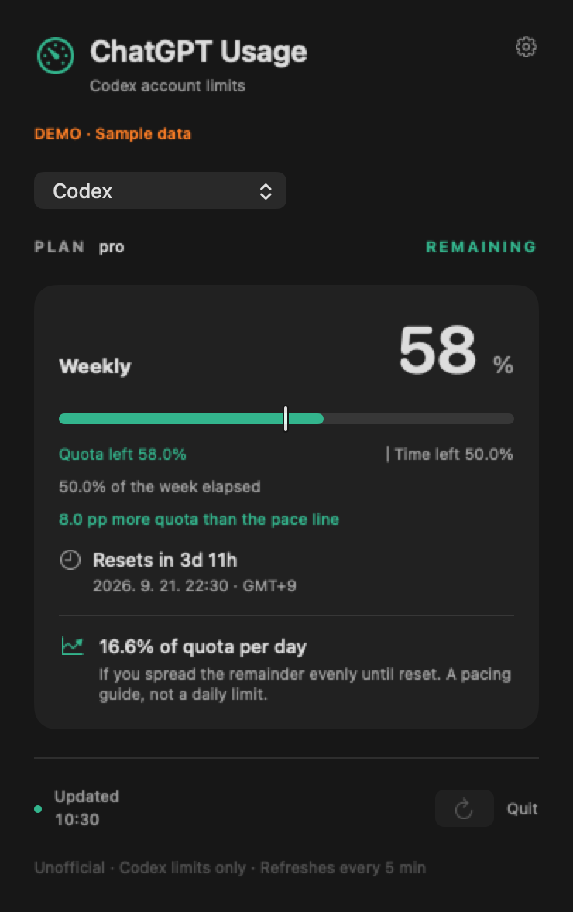

# ChatGPT Usage

**Your actual Codex quota and reset time, in the Mac menu bar.**

[한국어](README.ko.md) · [Download](https://github.com/Sunjae-L22/chatgpt-usage/releases) · [Report a problem](https://github.com/Sunjae-L22/chatgpt-usage/issues)

[Development story (Korean)](https://it-study-2002.tistory.com/entry/chatgpt-usage-codex-macos) · [Verified CI run](https://github.com/Sunjae-L22/chatgpt-usage/actions/runs/34976462549)

ChatGPT Usage is a small, unofficial native macOS app for **Codex subscription limits associated with your ChatGPT account**. It displays the windows your account actually reports, including weekly-only accounts, instead of assuming every plan has a five-hour limit.

It does **not** measure ordinary ChatGPT conversation message caps or OpenAI API spending. An account's reported quota percentage is not a remaining message or token count.



*The screenshot uses clearly labeled sample data. No personal account details are published.*

## What it does

- Menu bar percentage shows **remaining** quota for the selected bucket: weekly when available, otherwise the longest reported window.
- Shows all reported primary/secondary windows by their actual duration. A weekly-only account gets one card.
- Lets you switch between separately reported model or product buckets.
- Displays the server-reported plan identifier, reset timestamp in your local timezone, and countdown.
- Offers a simple daily pacing reference for windows of at least one day: `remaining quota / days until reset`. This is an even allocation, **not a forecast or an official daily limit**.
- Refreshes on launch, every five minutes, on wake, and when you open the panel after a minute. Manual refresh is available.
- Marks failed or old readings as stale. Crossing a reset time never silently creates a new 100% allowance.
- English and Korean interface; optional launch at login.

## Setup

1. Install [Codex](https://developers.openai.com/codex/cli/) or the Mac desktop app that includes the Codex executable.
2. Sign in to Codex using your **ChatGPT account**. Being signed in only to a browser tab may not be enough.
3. Download and unzip the Apple Silicon app from [Releases](https://github.com/Sunjae-L22/chatgpt-usage/releases), move it to a permanent folder such as Applications, and open it.
4. Look for `C …%` in the menu bar. Click it to see quota details. If Codex is not detected, use **Settings → Choose Codex…**.

**v0.1.1 is an experimental, ad-hoc-signed build. It is not Apple-notarized.** macOS may block a downloaded binary. Review the source or build locally if you prefer; this project does not ask you to disable Gatekeeper. The downloadable build is Apple Silicon only. The deployment target is macOS 14; see [verification](docs/VERIFICATION.md) for the actually tested environment.

The app finds Codex in common desktop-app, Homebrew, user-local, and `PATH` locations. `CODEX_BINARY_PATH` is also supported for command-line use. A path selected in Settings takes precedence. This app does not bundle Codex.

## Build from source

Requires Apple Command Line Tools with Swift 5.9+ and a macOS SDK supporting macOS 14 APIs. No third-party package dependencies or Xcode project are required.

```sh
git clone https://github.com/Sunjae-L22/chatgpt-usage.git
cd chatgpt-usage
make test
make bundle
open "dist/ChatGPT Usage.app"
```

`make` invokes `swiftc` directly and produces a statically linked app core for the current Mac architecture. A Swift Package manifest is also included for editors. The canonical build and verification commands are `make test` and `make bundle`.

```sh
make check                  # Live quota read; prints quota fields only
make run                    # Build, bundle, and open
```

For shareable screenshots without using a real account:

```sh
.build/direct/ChatGPTUsage --render-demo /tmp/usage-demo.png --language en
```

## How it works

```text
SwiftUI menu bar → local codex app-server → authenticated Codex service
                  initialize
                  initialized
                  account/rateLimits/read
```

The app starts a short-lived local subprocess, performs the documented initialization handshake, requests rate limits, and closes the subprocess. It uses the multi-bucket result when present and the legacy result as a fallback. `windowDurationMins` determines the labels; `primary` is never assumed to mean five hours.

Authentication and the upstream network request are handled by the installed Codex executable. The app does not directly read `auth.json`, browser cookies, Keychain credentials, session histories, or conversation contents. It does not start a model turn. It stores only language and binary-path preferences; quota readings stay in memory. App-server analytics are explicitly disabled for this subprocess.

Official protocol reference: [Codex App Server](https://developers.openai.com/codex/app-server/).

## Why another usage app?

[CodexBar](https://github.com/steipete/CodexBar) and [Codex Usage Bar](https://github.com/CMMUU/codex-usage-bar) already exist. This is a small learning project focused on an account-driven display, Korean/English UI, and an easy-to-understand pacing reference. It is not presented as the first quota monitor or as a replacement for every feature in those projects.

The motivation came from using [Claude Usage Tracker](https://github.com/hamed-elfayome/Claude-Usage-Tracker). This implementation is independently written; it does not incorporate that app's code or artwork. Codex assisted with implementation and verification.

## Limits and contributing

- Plan names are displayed as reported. An internal identifier such as `prolite` is not converted into an assumed retail plan name.
- The upstream protocol and account limits can change. Missing fields remain unknown.
- No automatic app updater, threshold notifications, account switching, or persistent history in v0.1.1.
- Launch-at-login requires a permanent app location and may require approval in macOS settings.

Feedback is welcome, especially on different account window shapes, accessibility, and macOS compatibility. See [CONTRIBUTING](CONTRIBUTING.md), [SECURITY](SECURITY.md), and [verification](docs/VERIFICATION.md). Never include tokens or personal account responses in an issue.

MIT licensed. Independent community project; not affiliated with or endorsed by OpenAI or Anthropic. Product names belong to their respective owners.
